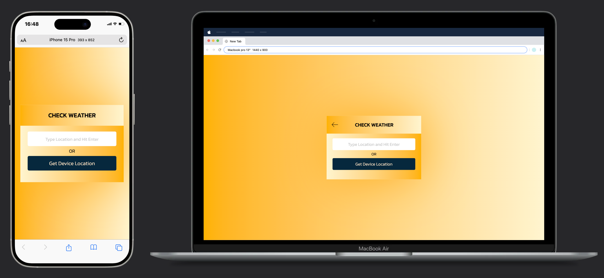

# Weather App

## Tech stack:

1. HTML
2. CSS
3. JAVASCRIPT
4. OPENWEATHERMAP API
5. LORDICONS

## Screenshots

## Features:

1. Vibrant
2. Responsive
3. Simple to use
4. Live 24x7

## Description

1. This website allows user to check current weather information either on desktop or mobile devices.
2. This app uses openweathermap api to fetch latest and reliable weather data in realtime.
3. User can either search by typing the location name or simply by clicking on the geolocation button.
4. The program also performs a spelling check on user input (location name) and give response message based on it.
5. Modern and Intuitive UI design aligns well with the project objectives.

## Live Preview 🚀

[Click Here](https://weather-app-nine-ochre.vercel.app/)
